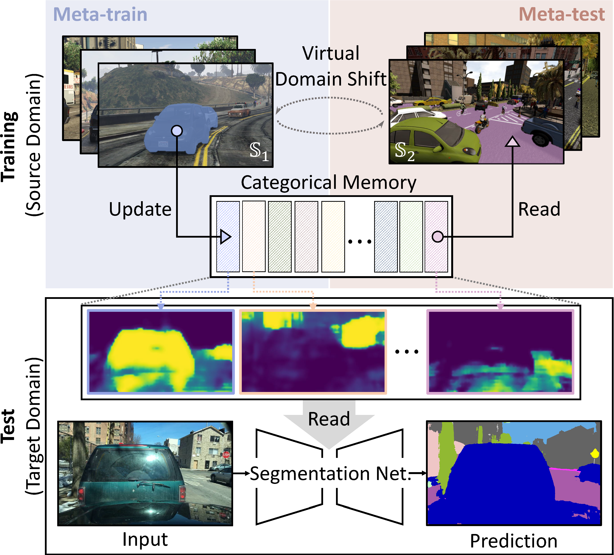

## PintheMemory (CVPR 2022): Official Project Webpage
This repository provides the official PyTorch implementation of the following paper:
> **Pin the Memory:** Learning to Generalize Semantic Segmentation<br>
> Jin Kim (Yonsei Univ.), Jiyoung Lee (NAVER AI Lab), Jungin Park (Yonsei Univ.)<br>
> Dongbo Min* (Ewha Womans Univ.), Kwanghoon Sohn* (Yonsei Univ.) (*: co-corresponding author)<br>
> CVPR 2022, Accepted as Poster<br>

> Paper: [arxiv](https://arxiv.org/abs/2204.03609)<br>

> **Abstract:** 
*The rise of deep neural networks has led to several breakthroughs for semantic segmentation.
In spite of this, a model trained on source domain often fails to work properly in new challenging domains, that is directly concerned with the generalization capability of the model. 
In this paper, we present a novel memory-guided domain generalization method for semantic segmentation based on meta-learning framework.
Especially, our method abstracts the conceptual knowledge of semantic classes into categorical memory which is constant beyond the domains.
Upon the meta-learning concept, we repeatedly train memory-guided networks and simulate virtual test to 1) learn how to memorize a domain-agnostic and distinct information of classes and 2) offer an externally settled memory as a class-guidance to reduce the ambiguity of representation in the test data of arbitrary unseen domain.
To this end, we also propose memory divergence and feature cohesion losses, which encourage to learn memory reading and update processes for category-aware domain generalization.
Extensive experiments for semantic segmentation demonstrate the superior generalization capability of our method over state-of-the-art works on various benchmarks.*<br>

<p align="center">
  
</p>

## Concept Video
Click the figure to watch the video of our paper.

<p align="center">
  <a href="https://youtu.be/LlEdudHMLII"></a><br>
</p>

## Pytorch Implementation

### Installation Requirements
```
python >= 3.6
Pytorch >= 1.9.0
CUDA version >= 11.0
Install dependencies
pip install -r requirements.txt
```

### Installation from Dockerfile
Clone this repository.
```
git clone https://github.com/Genie-Kim/PintheMemory.git
cd PintheMemory
```
Build docker image from Dockerfile
```
cd docker
sudo docker build --tag pinmem:1.0 .
```
Run container
```
sudo docker run -it --gpus all -h pinmem --name pinmem -v <your workspace>/PintheMemory:/home/pinmem/PintheMemory -v <your datasetpath>/dg_seg_dataset:/home/pinmem/dg_seg_dataset -v <your workspace>/experiment_pinmem:/home/pinmem/experiment_pinmem --ipc=host pinmem:1.0 script -q -c "/bin/bash" /dev/null
```

### How to Run
We evaludated our method on [Cityscapes](https://www.cityscapes-dataset.com/), [Mapillary Vistas](https://www.mapillary.com/dataset/vistas?pKey=2ix3yvnjy9fwqdzwum3t9g&lat=20&lng=0&z=1.5), [BDD-100K](https://bair.berkeley.edu/blog/2018/05/30/bdd/),[Synthia](https://synthia-dataset.net/downloads/) ([SYNTHIA-RAND-CITYSCAPES](http://synthia-dataset.net/download/808/)), [GTAV](https://download.visinf.tu-darmstadt.de/data/from_games/), [IDD](https://idd.insaan.iiit.ac.in/)

1. For Cityscapes dataset, download "leftImg8bit_trainvaltest.zip" and "gtFine_trainvaltest.zip" from https://www.cityscapes-dataset.com/downloads/<br>
```
cityscapes
 └ leftImg8bit_trainvaltest
   └ leftImg8bit
     └ train
     └ val
     └ test
 └ gtFine_trainvaltest
   └ gtFine
     └ train
     └ val
     └ test
```
```
bdd-100k
 └ images
   └ train
   └ val
   └ test
 └ labels
   └ train
   └ val
```
```
mapillary
 └ training
   └ images
   └ labels
 └ validation
   └ images
   └ labels
 └ test
   └ images
   └ labels
```

#### We used [GTAV_Split](https://download.visinf.tu-darmstadt.de/data/from_games/code/read_mapping.zip) to split GTAV dataset into training/validation/test set. Please refer the txt files.

```
GTAV
 └ images
   └ train
     └ folder
   └ valid
     └ folder
   └ test   
     └ folder
 └ labels
   └ train
     └ folder
   └ valid
     └ folder
   └ test   
     └ folder
```

#### We [Synthia dataset](http://synthia-dataset.net/download/808/) into train/val set. Please refer the txt files.

```
synthia
 └ RGB
   └ train
   └ val
 └ GT
   └ COLOR
     └ train
     └ val
   └ LABELS
     └ train
     └ val
```

2. You should modify the dataset path to "~/dg_seg_dataset/".
```
datasetroot = os.path.expanduser('~/dg_seg_dataset/')
```

### Pretrained Models
#### All models trained for our paper
You can download all models evaluated in our paper at [Google Drive](https://drive.google.com/drive/folders/19i1G-gcJ3BV_VxO0ZG9YMJ4Btyj8c6dM?usp=sharing)
For compatibility with scripts file, put the folder downloaded from the drive in "PintheMemory/pretrained_model".

### Train and Evaluation scripts
Please refer to the train, evaluation, tsne plot and memory activation scripts in the PintheMemory/pinmem_xx_scripts folders.

### T-sne plots
<p align="center">
  
</p>

## Acknowledgments
Our implementation is heavily derived from [RobustNet](https://github.com/shachoi/RobustNet) and [TSMLDG](https://github.com/koncle/TSMLDG).
Thanks to the RobustNet and TSMLDG implementations.